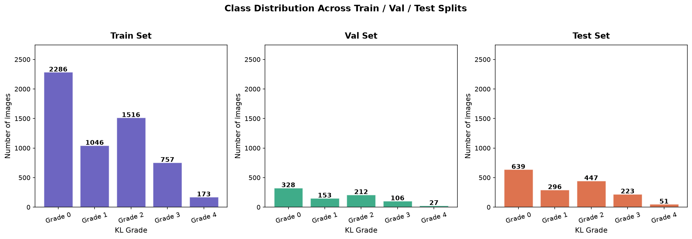
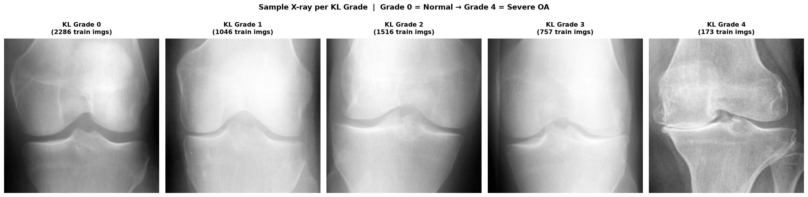
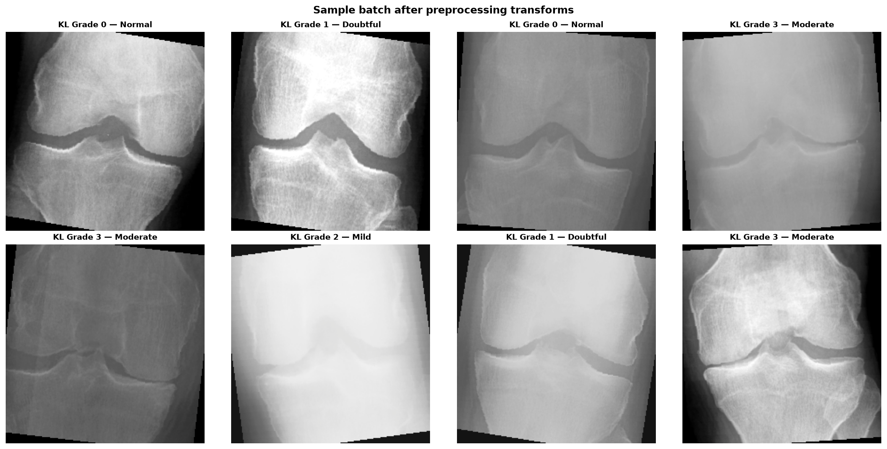
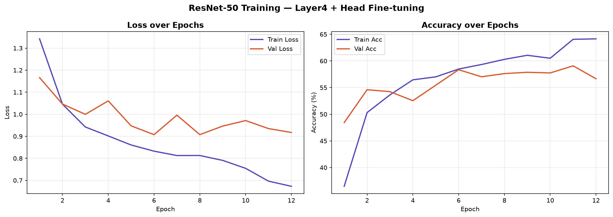
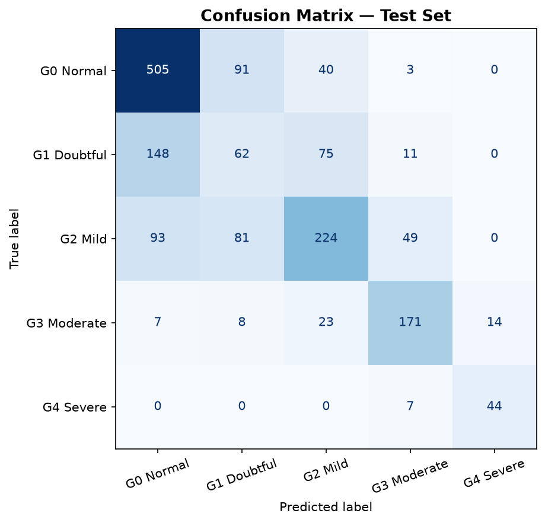
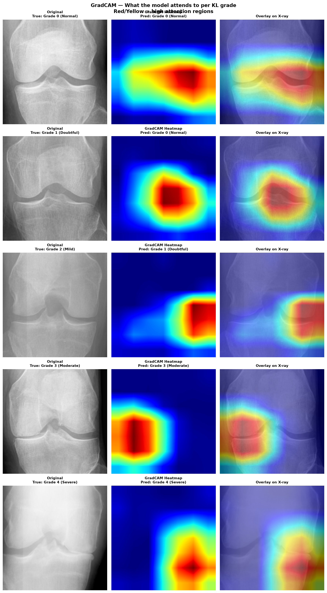

# Automated Knee Osteoarthritis Grading from X-rays

End-to-end deep learning pipeline to automatically classify knee osteoarthritis severity using the Kellgren-Lawrence (KL) grading system (grades 0–4) from radiographic images.

---

## Problem

Radiologists manually assign KL grades to knee X-rays to assess osteoarthritis severity. This process is subjective — inter-rater agreement drops significantly at borderline grades (1–2). This project trains a CNN to perform this grading automatically and explains its decisions using GradCAM.

---

## Dataset

8,800 knee X-ray images with KL grade labels (0–4) from the [Kaggle Knee OA Dataset](https://www.kaggle.com/datasets/shashwatwork/knee-osteoarthritis-dataset-with-severity).



Severe class imbalance: Grade 0 has 2,286 training images vs only 173 for Grade 4 (13:1 ratio). Handled using class-weighted loss during training.

---

## Sample X-rays per KL Grade



Grade 0 shows wide clear joint space. By Grade 4 the joint space is nearly gone with visible bone deformity.

---

## Preprocessing

Images converted from grayscale to RGB, normalized using ImageNet statistics, and augmented (random flip, rotation, brightness jitter) during training only.



---

## Model

ResNet-50 pretrained on ImageNet. Layers 1–3 frozen. Layer4 and custom classification head fine-tuned directly on knee X-rays.

```
Frozen    : Layers 1–3  (general feature detectors)
Trainable : Layer4 + Head  (15.5M parameters)
Head      : Linear(2048→256) → ReLU → Dropout(0.4) → Linear(256→5)
Loss      : CrossEntropyLoss with class weights
Optimizer : Adam lr=0.0001
```

---

## Training



Loss dropped steadily from 1.34 to 0.68 over 12 epochs. Val accuracy stabilized at ~58–60%. Early stopping triggered at best val loss of 0.9075.

---

## Results



| Grade | Correct | Total | Accuracy |
|-------|---------|-------|----------|
| G0 Normal | 505 | 639 | 79% |
| G1 Doubtful | 62 | 296 | 21% |
| G2 Mild | 224 | 447 | 50% |
| G3 Moderate | 171 | 223 | 77% |
| G4 Severe | 44 | 51 | 86% |

**Overall test accuracy: 61% · Grade 4 F1: 0.77 · Best val loss: 0.9075**

Grade 4 (severe OA) was never confused with Grade 0 or 1 — clinically the most important result. Grade 1 remains the hardest class, consistent with published literature and human radiologist disagreement.

---

## GradCAM Interpretability



GradCAM heatmaps show the model attends to the medial joint compartment and tibial plateau across all grades — anatomically consistent with radiologist decision-making. Even on misclassified cases (Grade 1 predicted as Grade 0), the model is looking at the correct anatomical region.

---

## Stack

PyTorch · ResNet-50 · GradCAM · Scikit-learn · Python 3.13

---

## Relevance

Directly replicates the approach of Pi et al. (Scientific Reports, 2023) who used ensemble deep learning + GradCAM on 8,260 knee X-rays for KL grading. Motivated by AI applications in clinical rheumatology imaging.
